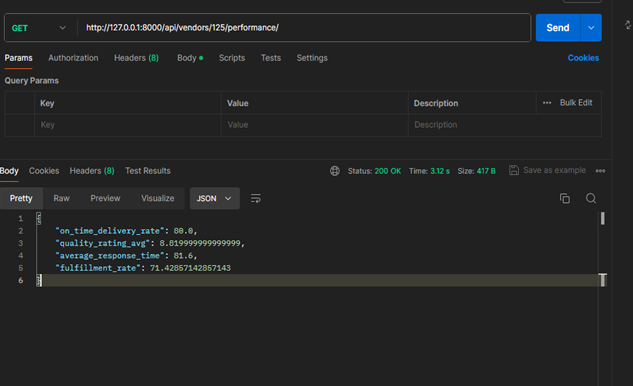

# Vendor Management System with Performance Metrics
Implemented a Vendor Management System using Django and Django REST Framework. This
system will handle vendor profiles, track purchase orders, and calculate vendor performance
metrics. This System will calculate the Realtime Performance of each Vendor using the vendor Code . 

## Core Features

There are 3 App in the Django Project named VendorProfile,PurchaseOrder,HistoricalPerformance which stores the information about vendor & purchase order and Provide tthe data integrity
using Foreign Key. 

1. Vendor Profile Management: 
API Endpoints: 
● POST http://127.0.0.1:8000/api/vendors/create/   :- Create a new vendor. 
● GET http://127.0.0.1:8000/api/vendors/   :- List all vendors. 
● GET http://127.0.0.1:8000/api/vendors/{vendor_code}/   :- Retrieve a specific vendor's details. 
● PUT http://127.0.0.1:8000/api/vendors/update/{vendor_code}/   :- Update a vendor's details. 
● DELETE http://127.0.0.1:8000/api/vendors/delete/{vendor_code}/    :- Delete a vendor. 

2. Purchase Order Tracking: 
API Endpoints: 
● POST http://127.0.0.1:8000/api/purchase_orders/create/: Create a purchase order. 
● GET http://127.0.0.1:8000/api/purchase_orders/: List all purchase orders with an option to filter by
vendor. 
● GET http://127.0.0.1:8000/api/purchase_orders/{po_number}/: Retrieve details of a specific purchase order. 
● PUT http://127.0.0.1:8000/api/purchase_orders/update/{po_number}/: Update a purchase order. 
● DELETE http://127.0.0.1:8000/api/purchase_orders/delete/{po_number}/: Delete a purchase order. 

3. Vendor Performance Evaluation: 
Metrics: 
● On-Time Delivery Rate: Percentage of orders delivered by the promised date. 
● Quality Rating: Average of quality ratings given to a vendor’s purchase orders. 
● Response Time: Average time taken by a vendor to acknowledge or respond to
purchase orders. 
● Fulfilment Rate: Percentage of purchase orders fulfilled without issues. 
API Endpoints: 
● GET http://127.0.0.1:8000/api/vendors/{vendor_code}/performance/: Retrieve a vendor's performance
metrics. 

## Backend Logic for Performance Metrics

These Metric calculate the Performance of the Particular Vendor using the Vendor code  

On-Time Delivery Rate: 
● Calculated each time a PO status changes to 'completed'. 
● Logic: Count the number of completed POs delivered on or before 
delivery_date and divide by the total number of completed POs for that vendor.

Quality Rating Average: 
● Updated upon the completion of each PO where a quality_rating is provided. 
● Logic: Calculate the average of all quality_rating values for completed POs of
the vendor. 

Average Response Time: 
● Calculated each time a PO is acknowledged by the vendor. 
● Logic: Compute the time difference between issue_date and
acknowledgment_date for each PO, and then find the average of these times
for all POs of the vendor. 

Fulfilment Rate: 
● Calculated upon any change in PO status. 
● Logic: Divide the number of successfully fulfilled POs (status 'completed'
without issues) by the total number of POs issued to the vendor. 
 
 

## To Run -

● pip install django,pymongo,djongo  
● python manage.py makemigration 
● python manage.py migrate 
● python manage.py runserver 

